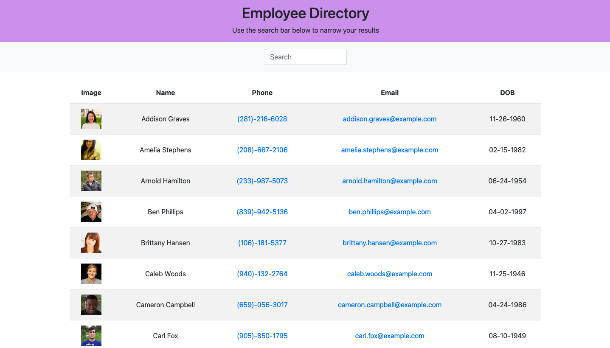

# User Directory

## Description 
For this project I have created a user directory. It pulls in information from the Random User API and displays it in a table. The table can be searched using a search bar or filtered by category (name, email, etc.). Technologies used are HTML, CSS, Javascript, React and Bootstrap. 

## Demo

https://kirmarnel.github.io/User-Directory/

## Table of Contents 
    
* [Installation](#installation)
* [Usage](#usage)
* [License](#license)
* [Contributing](#contributing)
* [Tests](#tests)
* [Questions](#questions)
    
    
## Installation Instructions 
To install dependancies and start this application run the following commands:
`npm i` 
`npm start`
## Usage 
This application allows the user to search other users via a search bar or filter users by category. 
## License 
This project is licensed with MIT
## Contributors 
Kirsten Nelson
## Tests 
No tests needed for this application
## Questions 
 For questions contact Kirsten Nelson at https://github.com/kirmarnel 